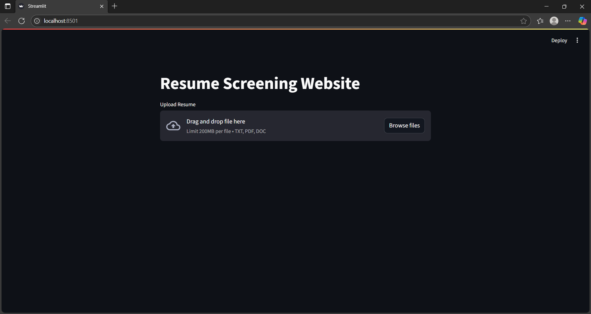

 # Resume-Screening-Website

A website that classifies resumes into job categories using Natural Language Processing (NLP) and Machine Learning (ML). Upload resumes in `.txt`, `.pdf`, or `.doc` formats and get instant category predictions.

---

## Features

- Resume parsing and text cleaning using custom NLP preprocessing
- Real-time prediction using **KNN Classifier**
- Feature extraction with **TF-IDF vectorization**
- Support for `.txt`, `.pdf`, and `.doc` files
- Clean and interactive **Streamlit** web interface
- Category mapping using **label encoding**

---

##  How It Works

1. User uploads a resume file.
2. The text is extracted and cleaned using regular expressions and NLTK.
3. Pre-trained **TF-IDF** model transforms the text into feature vectors.
4. A **KNN Classifier** predicts the most likely job category.
5. The category ID is decoded using a **label encoder**, and the result is displayed on the screen.

---

##  Demo Screenshot

---

## Tech Stack
<ul>
  <li>Python</li>
  <li>Streamlit</li>
  <li>scikit-learn</li>
  <li>NLTK</li>
  <li>TF-IDF</li>
  <li>KNN Classifier</li>
  <li>Regex</li>
  <li>Pickle</li>
</ul>

## Author
Shrey Gupta
